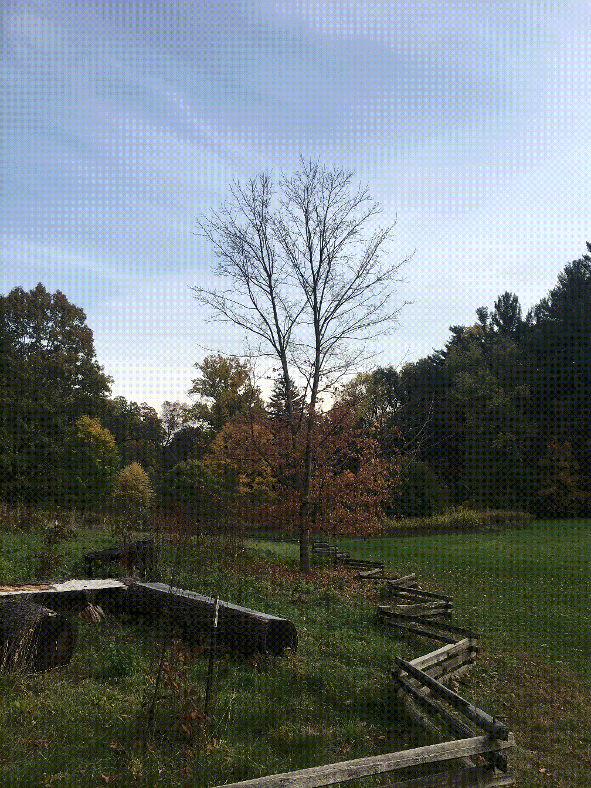
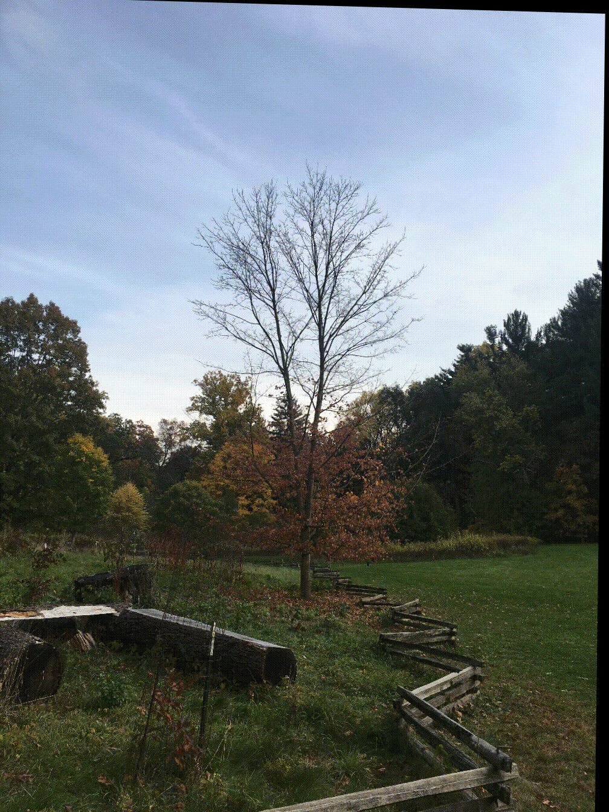

# Image Alignment for Time-lapse Photography

Automatically fix the position of the tree in the middle of picture.

|Source|Output|
|---|---|
|||

Algorithm
---------
1. Feature extraction with scale-invariant feature transform (SIFT)
2. Feature matching with brute force matcher
3. Determine homography transformation with Random sample consensus (RANSAC) 

## Usage
### Download Image
Download image from [google drive](https://drive.google.com/drive/folders/1k9_P97V5qAL2yxYQVyTRBHKUdpz-wirv?usp=sharing)
Save images into the directory `./TreePhotos`

### Run script
`$ python align.py`

### Create gif
`$ ffmpeg -i Output/%04d.jpg -vf fps=2 output.gif`

#### Acknowledge
Thanks to Jing An Tzeng for taking all the photos in Michigan. View his website [here](https://robintzeng.github.io/).